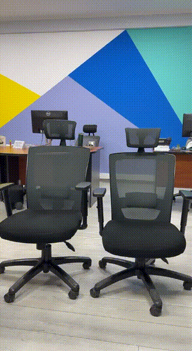

# Train Seat Monitor

Real-time seat occupancy detection for train wagons. YOLO runs on the edge device - only lightweight JSON events are forwarded, not raw video.

> Made for the lecture **"Big Data Pipelines for Computer Vision: Real-Time Processing of Video Streams"** at AZTU (*Azerbaijan Technical University*).

## Demo

| Raw feed | With detection |
|:---:|:---:|
|  |  |

## Pipeline

```
config.json → setup.py → mark_roi.py → main.py → RabbitMQ → .NET API → SSE → Browser
```

| Step | What it does |
|---|---|
| `config.json` | Defines train → wagon → camera structure. `seats` starts empty. |
| `setup.py` | Connects to each camera URL, captures one frame, saves to `empty-states/`. |
| `mark_roi.py` | Opens each empty frame. You click to draw boxes around seats. Coords saved back to `config.json`. |
| `main.py` | One process per camera. Detects persons in each seat region. Publishes change events to RabbitMQ. |
| `.NET API` | Consumes RabbitMQ queue, pushes events to browser via SSE. |

**Why SSE, not WebSocket/SignalR?** The browser only reads - server pushes. SSE is simpler, native to browsers, no extra library.

**Why not Kafka/Redis?** They'd be overkill here. RabbitMQ is enough.

## Scale

| | Count |
|---|---|
| Cameras per wagon | 10 |
| Wagons per train | 10 |
| Trains | 50 |
| **Total cameras** | **5,000** |
| Frames analyzed/sec | **15,000/sec** |

Sending raw video from 5,000 cameras is not feasible - this is exactly why the pipeline exists.

## Setup from scratch

**1. Define your cameras in `config.json`** - leave `seats` empty for now:

```json
{
  "trains": [{
    "id": "train_1",
    "wagons": [{
      "id": "wagon_1",
      "cameras": [{
        "id": "cam_front",
        "url": "rtsp://...",
        "seats": []
      }]
    }]
  }]
}
```

**2. Install Python dependencies:**

```bash
cd cv
python3 -m venv venv
source venv/bin/activate
pip install -r requirements.txt
```

**3. Capture empty frames:**

```bash
python setup.py
```

Reads `config.json`, connects to each camera URL, saves one empty frame per camera to `cv/public/empty-states/`. These frames are used in the next step.

**4. Mark seat regions:**

```bash
python mark_roi.py
```

Opens each empty frame. Click twice to draw a bounding box around each seat. Press any key to move to the next camera. Seat coordinates are saved back into `config.json` automatically.

## Running

**Start RabbitMQ:**

```bash
docker run -d --name rabbitmq -p 5672:5672 -p 15672:15672 rabbitmq:management
```

**Start CV:**

```bash
cd cv && source venv/bin/activate

python main_simple.py   # demo: single camera, draws bounding boxes on screen
python main.py          # production: all cameras in parallel, publishes to RabbitMQ
```

**Start API:**

```bash
cd api/SeatMonitorApi && dotnet run
```

Live seat map: `http://localhost:5212`

RabbitMQ panel: `http://localhost:15672` (guest / guest)
