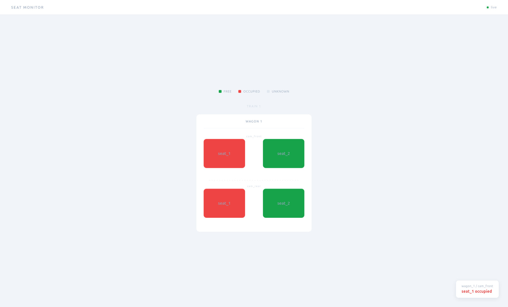
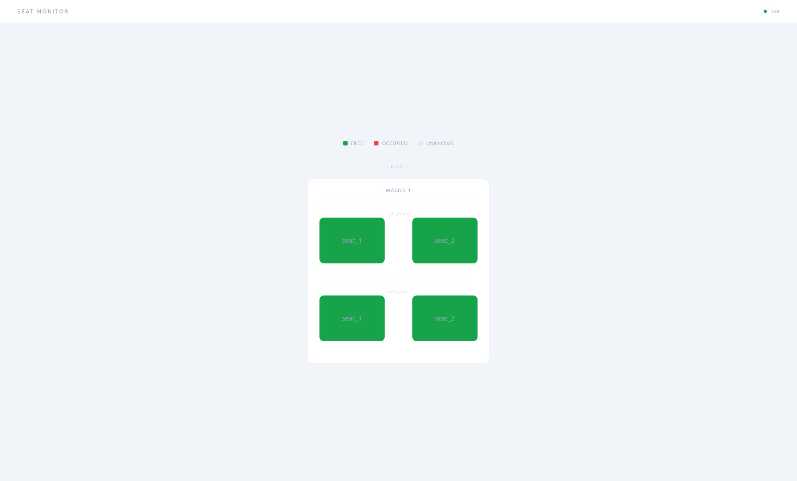

# Train Seat Monitor

A simulation project for the lecture: **"Big Data Pipelines for Computer Vision: Real-Time Processing of Video Streams"** in AZTU (Azerbaijan Technical University)

## Overview

Real-time seat occupancy detection for train wagons. Processing runs on the edge device, only lightweight JSON events are forwarded, not raw video streams.

## Dashboard




## Architecture

```
Camera -> Frame Skip -> YOLO (person detection) -> ROI Check -> RabbitMQ -> .NET API -> SSE -> Browser
```

- **Frame skip**: every 5th frame is analyzed, reducing load by 80%
- **ROI**: only the marked seat region is cropped and passed to YOLO, not the full frame
- **YOLO (yolov8n)**: detects persons inside the cropped region
- **Change-only publish**: event is sent only when seat status changes (free / occupied)
- **RabbitMQ**: `passenger-seat` queue (quorum, durable) decouples CV from backend
- **Multiprocessing**: each camera runs in its own process in parallel
- **SSE**: `.NET API` pushes seat events to the browser via Server-Sent Events
- **Live dashboard**: SVG-based seat map, seat colors update in real time without page reload

## Scale

| Level | Count |
|---|---|
| Cameras per wagon | 10 |
| Wagons per train | 10 |
| Trains | 50 |
| **Total cameras** | **5,000** |
| Frames analyzed/sec (15fps, every 5th) | **15,000/sec** |

Sending raw video at this scale is infeasible: this is why the pipeline exists.

## Project Structure

```
├── cv/
│   ├── main.py            # Production: multiprocessing, one process per camera, publishes to RabbitMQ
│   ├── main_simple.py     # Demo: single camera, no RabbitMQ, draws bounding boxes on screen
│   ├── mark_roi.py        # Tool to mark seat regions and save to config.json
│   ├── settings.py        # Paths (config, video source, model)
│   └── yolov8n.pt         # YOLO model weights
├── api/
│   └── SeatMonitorApi/
│       ├── Program.cs            # Endpoints: GET /api/layout, GET /events (SSE)
│       ├── SeatEventBus.cs       # In-process broadcast: Channel<T> per subscriber
│       ├── SeatEventConsumer.cs  # RabbitMQ BackgroundService, publishes to bus
│       ├── SeatEvent.cs          # Record: TrainId, WagonId, CameraId, SeatId, Status
│       └── wwwroot/
│           └── index.html        # Live SVG seat map, auto-generated from /api/layout
├── docs/
│   ├── dashboard-mixed.jpeg
│   └── dashboard-free.jpeg
└── config.json            # Train -> wagon -> camera -> seat coords
```

## Running

**Prerequisites**
```bash
docker start rabbitmq   # or: docker run -d --name rabbitmq -p 5672:5672 -p 15672:15672 rabbitmq:management
```

**CV (producer)**
```bash
cd cv
source venv/bin/activate

python main_simple.py   # demo mode: shows video with seat labels
python main.py          # full mode: all cameras in parallel, publishes to RabbitMQ
```

**API (consumer + dashboard)**
```bash
cd api/SeatMonitorApi
dotnet run
```

Open `http://localhost:5212` to see the live seat map.

**RabbitMQ management panel:** `http://localhost:15672` (guest / guest)

## Setup from scratch

**1. Edit `config.json`** with your train/wagon/camera structure (leave seats empty):
```json
{
  "trains": [{
    "id": "train_1",
    "wagons": [{
      "id": "wagon_1",
      "cameras": [{
        "id": "cam_front",
        "url": "rtsp://...",
        "seats": []
      }]
    }]
  }]
}
```

**2. Install dependencies**
```bash
cd cv
python3 -m venv venv
source venv/bin/activate
pip install -r requirements.txt
```

**3. Extract empty states**
```bash
python setup.py
```

Reads `config.json`, captures one frame per camera from the video source, saves them to `cv/public/empty-states/`. These frames are used as the background for marking seats.

**4. Mark seat regions**
```bash
python mark_roi.py
```

Opens each empty state image. Draw bounding boxes around each seat. Saves seat coords into `config.json` automatically.
